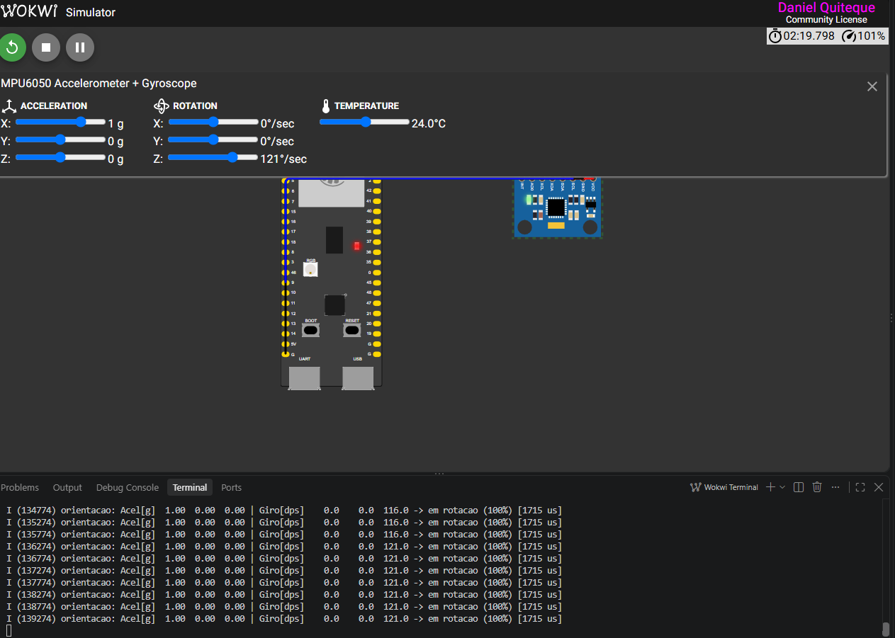
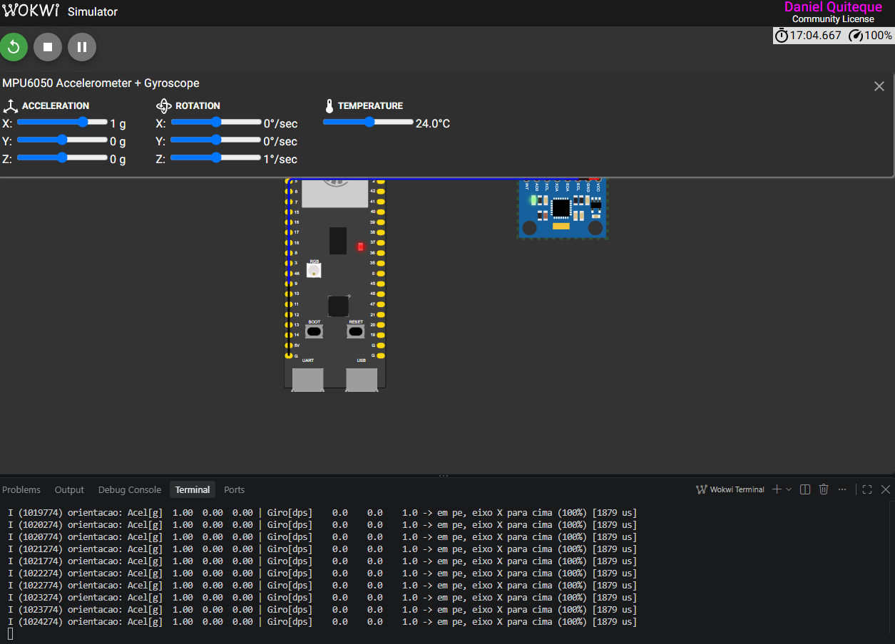

# Atividade 4/6 — Extra: classificação de orientação com MPU6050 + TFLite Micro

Nova aplicação construída a partir do Hello World, como pede o extra da atividade:

| | Hello World | Esta aplicação |
|---|---|---|
| **Sensor** | nenhum (x é calculado no código) | **MPU6050** (acelerômetro + giroscópio) via I2C |
| **Dataset** | 1000 pontos de `sin(x)` | **8500 leituras rotuladas** de acelerômetro/giroscópio ([dataset_orientacao.csv](train/dataset_orientacao.csv)) |
| **Tarefa** | regressão (1 entrada → 1 saída) | **classificação** (6 entradas → 7 classes, softmax) |
| **Modelo** | Dense 32 → 32 → 1 | Dense 16 → 16 → 7, retreinado do zero |
| **Ops no MCU** | FullyConnected | FullyConnected + Softmax |

O ESP32-S3 lê o sensor a cada 500 ms e diz em que posição a placa está, ou se ela está girando.

## Classes

| # | Classe | Condição física |
|---|---|---|
| 0 | plana, face para cima | gravidade no eixo Z+ |
| 1 | plana, face para baixo | gravidade no eixo Z− |
| 2 | em pé, eixo X para cima | gravidade no eixo X+ |
| 3 | em pé, eixo X para baixo | gravidade no eixo X− |
| 4 | de lado, eixo Y para cima | gravidade no eixo Y+ |
| 5 | de lado, eixo Y para baixo | gravidade no eixo Y− |
| 6 | em rotação | giroscópio acima de ~60 °/s, em qualquer orientação |

A classe 6 exige que o modelo combine os dois sensores: com a placa girando, a orientação deixa de
importar.

## Dataset

Sem uma placa física para coletar dados, o dataset foi **gerado a partir da física do sensor**
([train_orientacao.py](train/train_orientacao.py)):

- **Parado:** o acelerômetro mede só a gravidade, um vetor de ~1 g que aponta para cima no referencial
  da placa. Foram sorteadas direções uniformes na esfera, com magnitude de 0,7 a 1,5 g (o painel do
  Wokwi permite valores fora de 1 g), ruído gaussiano de 0,03 g e tremor de até 30 °/s no giroscópio.
  O rótulo é o eixo com a maior componente da gravidade.
- **Em rotação:** qualquer orientação, de 60 a 250 °/s em um eixo aleatório e ruído maior na aceleração.
- **Saturação:** valores limitados a ±2 g e ±250 °/s, como no MPU6050 configurado no driver.

Divisão: 80% para treino (15% deste para validação) e 20% para teste.

## Resultados

| Modelo | Tamanho | Acurácia no teste |
|---|---|---|
| float32 | 4204 B | 97,29% |
| **int8** (embarcado) | **4072 B** | **96,71%** |

Os erros se concentram perto de 45°, onde a placa está "entre" duas orientações. A quantização int8
custa só 0,6 ponto percentual.

## Pipeline no dispositivo ([main.cc](main/main.cc))

1. Leitura de 14 bytes do MPU6050 por I2C (driver da atividade 2/6).
2. Normalização: aceleração em g; giroscópio dividido por 250 (mesma escala do treino).
3. Quantização int8 **com arredondamento e saturação**, que corrige a observação 5 do relatório do Hello World.
4. `Invoke()` e tempo de inferência medido com `esp_timer_get_time()`.
5. `argmax` da saída e desquantização da probabilidade da classe vencedora.

Exemplo de saída:

```
I (xxx) orientacao: Acel[g]  0.00  0.00  1.00 | Giro[dps]    0.0    0.0    0.0 -> plana, face para cima (99%) [xxx us]
```

## Como testar no Wokwi

1. Abra esta pasta no VS Code e rode `Ctrl+Shift+P` → **Wokwi: Start Simulator**.
2. Clique no MPU6050 e ajuste os controles. Casos já verificados com o modelo int8:

| Aceleração (x, y, z) [g] | Rotação (x, y, z) [°/s] | Classe esperada |
|---|---|---|
| 0, 0, 1 | 0, 0, 0 | plana, face para cima |
| 0, 0, −1 | 0, 0, 0 | plana, face para baixo |
| 1, 0, 0 | 0, 0, 0 | em pé, eixo X para cima |
| 0, −1, 0 | 0, 0, 0 | de lado, eixo Y para baixo |
| 0.5, 0.2, 0.8 | 0, 0, 0 | plana, face para cima (inclinada) |
| 0, 0, 1 | 0, 0, 120 | em rotação |

## Execução no Wokwi

| Aceleração [g] | Rotação [°/s] | Classe prevista | Confiança | Inferência |
|---|---|---|---|---|
| 1, 0, 0 | 0, 0, 121 | em rotação | 100% | 1715 µs |
| 1, 0, 0 | 0, 0, 1 | em pé, eixo X para cima | 100% | 1879 µs |

Com a mesma aceleração, a classe muda apenas pelo giroscópio:





## Reproduzir o treino

```bash
pip install tensorflow
python train/train_orientacao.py
```

Isso gera o CSV, os `.tflite` em `train/output/` e o `main/model.cc`.

## Limitações

- O dataset é sintético. Com uma placa real, o próximo passo seria coletar leituras gravando o serial
  da atividade 2/6 e fazer *fine-tuning* com esses dados.
- Uma única leitura não distingue "girando devagar" de "parado com tremor"; uma janela de várias
  leituras (como no UCI HAR) resolveria isso.
