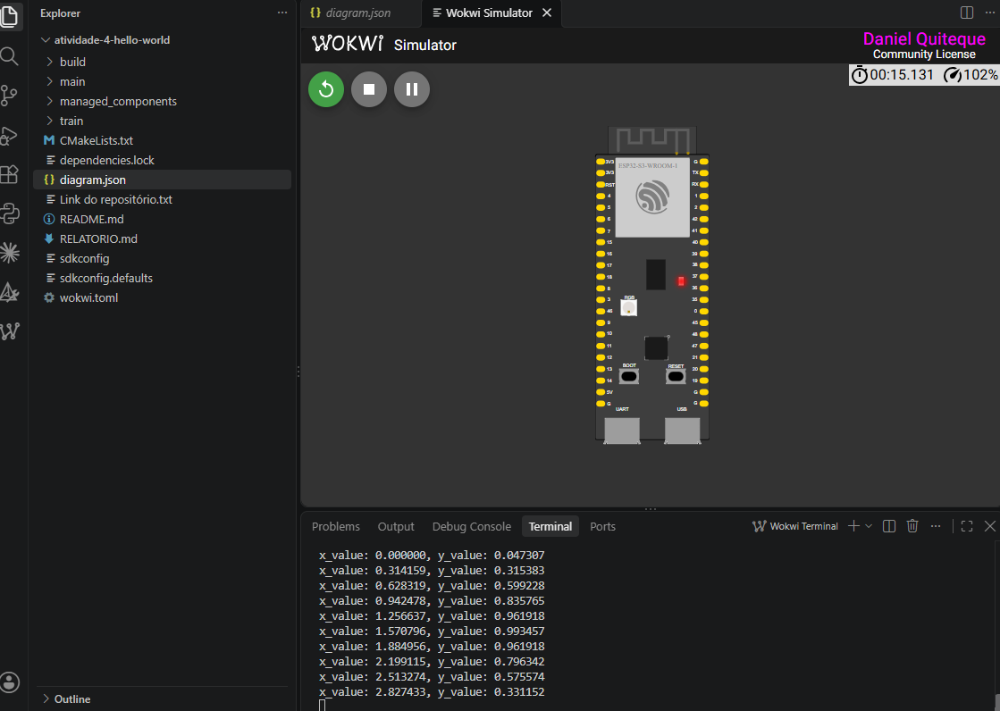

# Atividade Avaliativa Prática 4/6 — Hello World com TFLite Micro

Reprodução do exemplo **Hello World** do [esp-tflite-micro](https://github.com/espressif/esp-tflite-micro/tree/master/examples/hello_world)
em um **ESP32-S3** simulado no **Wokwi**: uma rede neural quantizada em int8 aproxima `y = sin(x)`
e imprime os pares `x_value / y_value` no monitor serial.

O modelo foi **retreinado** seguindo o notebook da disciplina (`train/train_hello_world.py`) e
convertido para `main/model.cc`. O relatório de análise está em [RELATORIO.md](RELATORIO.md).

## Estrutura

```
├── CMakeLists.txt          # projeto + desativa ESP-NN para o Wokwi
├── sdkconfig.defaults      # target esp32s3
├── diagram.json / wokwi.toml
├── main/
│   ├── idf_component.yml   # dependência espressif/esp-tflite-micro 1.4.1
│   ├── main.cc             # app_main: setup() e loop() a cada 500 ms
│   ├── main_functions.cc   # pipeline TFLM: modelo → interpretador → inferência
│   ├── constants.*         # faixa de x (0 a 2π) e inferências por ciclo
│   ├── output_handler.*    # imprime x e y no serial
│   └── model.cc / model.h  # modelo int8 como array C
└── train/
    ├── train_hello_world.py  # treino → float .tflite → int8 .tflite → model.cc
    └── official_model.cc     # modelo original do exemplo, para comparação
```

## Passo a passo

### 1. Treinar e converter o modelo (opcional — `main/model.cc` já está gerado)

```bash
pip install tensorflow
python train/train_hello_world.py
```

O script reproduz o notebook: treina a rede (Dense 32 → 32 → 1), exporta o SavedModel, converte para
`.tflite` float e int8 (quantização pós-treino com dataset representativo), compara MAE/RMSE e gera o
`model.cc` (equivalente a `xxd -i hello_world_int8.tflite > model.cc`).

### 2. Build e simulação

1. Abra esta pasta no VS Code com as extensões **ESP-IDF** e **Wokwi Simulator**.
2. Selecione o target **esp32s3** e clique em **Build**. O component manager baixa o
   `esp-tflite-micro` para `managed_components/` automaticamente.
3. Abra `diagram.json` e inicie a simulação.

### Ajuste para rodar no Wokwi (ESP-NN)

O Wokwi não simula as instruções SIMD do ESP32-S3 usadas pelo ESP-NN. Na aula isso foi resolvido
comentando a linha `target_compile_options(${COMPONENT_LIB} PRIVATE -DESP_NN)` no `CMakeLists.txt` do
esp-tflite-micro. Aqui o mesmo efeito é obtido no `CMakeLists.txt` do projeto, removendo `-DESP_NN` das
opções de compilação do componente — assim o componente baixado não precisa ser editado.

## Entrega

- [x] Print do Wokwi rodando o Hello World: [docs/wokwi-hello-world.png](docs/wokwi-hello-world.png)
- [x] Relatório: [RELATORIO.md](RELATORIO.md) (versão em PDF: [Daniel Quiteque_relatorio_atividade4.pdf](Daniel%20Quiteque_relatorio_atividade4.pdf))


